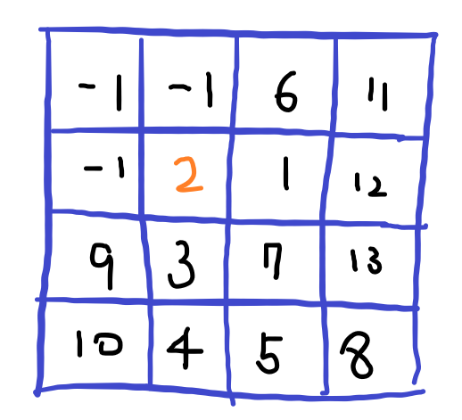
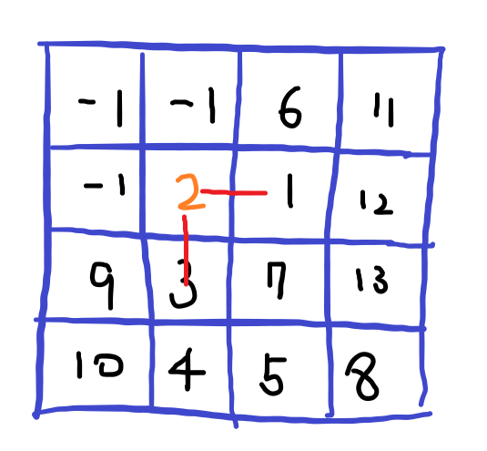
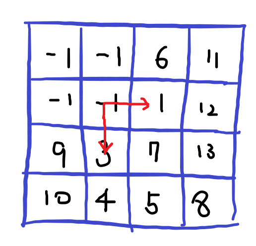
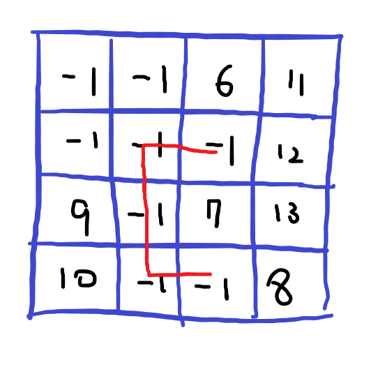

# [SWEA] 1861. 정사각형 방 [D4]

## 📚 문제

https://swexpertacademy.com/main/code/problem/problemDetail.do?contestProbId=AV5LtJYKDzsDFAXc&categoryId=AV5LtJYKDzsDFAXc&categoryType=CODE&problemTitle=1861&orderBy=FIRST_REG_DATETIME&selectCodeLang=ALL&select-1=&pageSize=10&pageIndex=1

---

델타 탐색을 활용한다. 처음엔 재귀로 풀었는데 재귀를 이용해서 구하면 깊이 제한이 걸린다. 

**sys.setrecursionlimit(10000)**를 사용하면 재귀 제한을 풀 수 있지만 SWEA 제출에서는 막혀있다.

백트래킹 할 필요가 없으니 반복문으로 해결한다.

현재 위치랑 연결되어있는 모든 범위를 다 check해서 시작 지점과 이동 거리를 반환한다.

check를 **BFS**로 해결한다. 여러 방향으로 연결되지 않지만 뒤로 연결되는 경우에 좀 더 빠르게 확인할 수 있다.

확인한 값을 또 확인하지 않기 위해 지나간 길은 -1로 바꾼다.

check 함수 구현을 그림으로 확인해본다.



현재 확인하는 위치는 2이다. 그리고 시작지점은 2, 이동 횟수는 1이다.(default : 1)

2에서 주변 네 방향을 탐색해 1크거나 작은 수로 BFS 탐색이니 큐에 담으며 전진한다.



2에서 1로 작아졌으므로 최솟값은 1, 이동은 3으로 이동한 것까지 2번 했으니 1+ 2 = 3이다.



이동하면서 원래 위치는 -1로 바꿔준다. 다시 탐색하지 않기 위함이다.



이제 뒤로는 안가므로 커지는 숫자만 확인해 이동횟수에 더해준다.

최종적으로 1,2,3,4,5가 연결되어있었으니, 총 이동 횟수는 5, 시작지점 1을 리턴해준다.

위 check 함수를 활용해 가지치기를 통해 배열을 돌며 -1이 아닌 경우만 확인해주면 된다.

## 📒 코드

```python
from collections import deque


def check(y, x):    # 현재 위치에서 최대 이동 횟수를 찾는다.
    cnt = 1     # 이동 횟수, default가 1
    num = arr[y][x]
    queue = deque()
    queue.append([y, x])
    while queue:
        y, x = queue.popleft()
        for i in range(4):  # 4방향 탐색
            ny = y + dy[i]
            nx = x + dx[i]
            if 0 <= ny < n and 0 <= nx < n: 
                if abs(arr[ny][nx] - arr[y][x]) == 1:    # 1 크거나 같은 경우
                    if arr[ny][nx] - arr[y][x] == -1: # 1 더 작은 경우
                        num = arr[ny][nx]             # 시작점 변경
                    cnt += 1
                    queue.append([ny, nx])
        arr[y][x] = -1
    return cnt, num


t = int(input())
dy = [0, 1, 0, -1]  # 우 하 좌 상
dx = [1, 0, -1, 0]
for tc in range(1, t + 1):
    n = int(input())
    arr = [list(map(int, input().split())) for _ in range(n)]
    room = 0        # 방 번호
    max_cnt = 0     # 이동 횟수
    for i in range(n):
        for j in range(n):
            if arr[i][j] != -1:
                cnt, num = check(i, j)
                if cnt > max_cnt or (cnt == max_cnt and num < room):
                    room = num
                    max_cnt = cnt
                
    print(f'#{tc}', room, max_cnt)

```

## 🔍 결과 : Pass