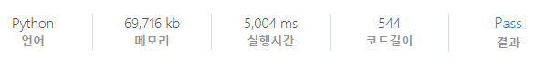

# [SWEA] 1865. 동철이의 일 분배 [D4]

## 📚 문제

https://swexpertacademy.com/main/code/problem/problemDetail.do?contestProbId=AV5LuHfqDz8DFAXc&categoryId=AV5LuHfqDz8DFAXc&categoryType=CODE&problemTitle=%EB%8F%99%EC%B2%A0%EC%9D%B4%EC%9D%98+%EC%9D%BC&orderBy=FIRST_REG_DATETIME&selectCodeLang=ALL&select-1=&pageSize=10&pageIndex=1

---

## 📖 풀이

중복없는 순열 문제이다. 여기서는 값을 곱해가면서 구하는데, 곱할수록 값이 작아지는 걸 활용해 가지치기 한다.

곱할수록 값이 작아지니, 현재 구한 최대 확률보다 지금 구하고 있는 확률이 더 작으면 종료하고 다음 재귀를 탐색한다.

## 📒 코드

```python
def recur(cur, percent):
    global mmax
    if percent <= mmax:
        return
    if cur == n:
        mmax = max(mmax, percent)
        return

    for i in range(n):
        if visited[i]:
            continue
        visited[i] = 1
        recur(cur + 1, percent * (arr[cur][i] / 100))
        visited[i] = 0


t = int(input())
for tc in range(1, t + 1):
    n = int(input())
    arr = [list(map(int, input().split())) for _ in range(n)]
    visited = [0 for _ in range(n)]
    mmax = 0
    recur(0, 1)
    print(f'#{tc} {mmax * 100:.6f}')
```

## 🔍 결과

