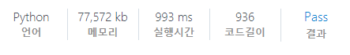

# [SWEA] 2819. 격자판의 숫자 이어 붙이기 [D4]

## 📚 문제

https://swexpertacademy.com/main/code/problem/problemDetail.do?contestProbId=AV7I5fgqEogDFAXB&categoryId=AV7I5fgqEogDFAXB&categoryType=CODE&problemTitle=2819&orderBy=FIRST_REG_DATETIME&selectCodeLang=ALL&select-1=&pageSize=10&pageIndex=1

---

델타 탐색을 통한 순열문제로 **DFS 탐색** 문제이다.

모든 배열의 위치를 초기값으로 하여 각각 DFS 탐색을 한다.

재귀함수로 7번 탐색하면 순열을 확인하고 return하도록 만든다.

visited를 활용해 중복을 제거한다.

0~9까지를 9번 곱한 배열을 만들 순 없으니 visited를 set자료형으로 만들어 값이 같은지 확인한다.

set로 확인하기 위해 수정할 수 없는 자료형을 담아줘야하기 때문에 리스트를 사용할 수 없다.

따라서 문자열로 바꿔준 후 넣어준다.

## 📒 코드

```python
def recur(cur, y, x):
    if cur == 7:                # 7번째 순열을 다 돌았을 때
        string = str(visited)   # 값을 string으로 변환
        result.add(string)      # set 자료형으로 중복 제거하여 넣어준다.
        return

    for i in range(4):          # 델타 탐색
        ny = y + dy[i]
        nx = x + dx[i]
        if 0 <= ny < 4 and 0 <= nx < 4:     # 인덱스 초과하지 않는 범위에서
            visited[cur] = arr[ny][nx]
            recur(cur + 1, ny, nx)


dy = [0, 1, 0, -1]                      # 우 하 좌 상
dx = [1, 0, -1, 0]
for tc in range(1, int(input()) + 1):
    arr = [list(map(int, input().split())) for _ in range(4)]
    visited = [-1 for _ in range(7)]    # 탐색할 순열을 담는다.
    result = set()                      # 중복제거하여 값을 담아주기 위해 set 자료형 사용
    for i in range(4):                  # 초기값 세팅
        for j in range(4):
            recur(0, i, j)
    print(f'#{tc} {len(result)}')
```

## 🔍 결과



