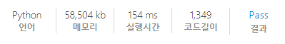

# [SWEA] 4366. 정식이의 은행업무 [D4]

## 📚 문제

https://swexpertacademy.com/main/code/problem/problemDetail.do?contestProbId=AWMeRLz6kC0DFAXd&categoryId=AWMeRLz6kC0DFAXd&categoryType=CODE&problemTitle=%EC%A0%95%EC%8B%9D%EC%9D%B4%EC%9D%98&orderBy=FIRST_REG_DATETIME&selectCodeLang=ALL&select-1=&pageSize=10&pageIndex=1

---

## 📖 풀이

입력으로 들어오는 2진수를 for문으로 한 자리씩 xor 연산을 통해 뒤집어 준다.

그리고 10진수로 바꾼 후 3진수로 변경한다.

3진수로 바꾼 값이 기존의 3진수와 문자열 하나씩 비교하여 차이가 하나만 나는 경우 그 떄의 10진수 값을 출력한다.

## 📒 코드

```python
def binary_to_decimal():    # 2진수를 10진수로 변경(string => int)
    cnt = 1
    decimal = 0
    for c in two[::-1]:
        decimal += cnt * c
        cnt *= 2
    return decimal


def decimal_to_ternary(decimal):    # 10진수를 3진수 변경(int => string)
    result = ''
    while decimal >= 3:
        result = str(decimal % 3) + result
        decimal //= 3
    if decimal:
        result = str(decimal) + result
    return result


def func():
    for i in range(len(two)):
        two[i] = two[i] ^ 1                 # 2진수를 한 자리씩 변경
        decimal = binary_to_decimal()       # 2진수를 10진수로 변경
        ans = decimal_to_ternary(decimal)   # 10진수을 3진수으로 변경
        if len(ans) == len(three):          # 서로 길이가 같은 지 확인
            cnt = 0
            for j in range(len(three)):     # 다른 개수가 하나인지 확인
                if cnt == 2:                # 다른 개수가 2이상이면 break
                    break
                if ans[j] != three[j]:
                    cnt += 1
            else:                           # 다른 개수가 하나일 때 return
                if cnt == 1:
                    return decimal
        two[i] = two[i] ^ 1                 # 바꿔준 자리를 원상복구


for tc in range(1, 1 + int(input())):
    two = list(map(int, input()))
    three = input()
    print(f'#{tc} {func()}')
```

## 🔍 결과

