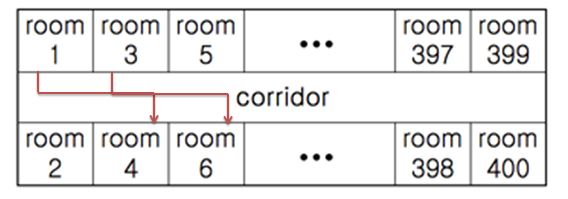

# [SWEA] 4408. 자기 방으로 돌아가기 [D4]

## 📚 문제

https://swexpertacademy.com/main/code/problem/problemDetail.do?contestProbId=AWNcJ2sapZMDFAV8&categoryId=AWNcJ2sapZMDFAV8&categoryType=CODE&problemTitle=4408&orderBy=FIRST_REG_DATETIME&selectCodeLang=ALL&select-1=&pageSize=10&pageIndex=1

---



모든 학생이 자기 방으로 돌아가는 최단 시간을 구해야 한다.

일단 홀수 번 방이랑 짝수 번 방이 같은 라인에 있는 경우는 같은 공간을 차지한다. 따라서 홀수 이면 1을 더해 2로 나누어주고 짝수이면 그냥 2로 나누어준다.

이 과정을 입력 부분에 함수를 사용해서 만들어 주었다.

학생들의 경로를 확인 했을 때 겹치는 횟수가 최단 시간이다.

따라서 1~200번까지 방 앞을 지나는 숫자를 count해서 그 경우 가장 큰 값을 출력하면 된다.

## 📒 코드

```python
def room_number(number):    # 짝수와 홀수번째 방이 같은 라인에 있으면 같은 숫자로 변환
    new_number = int(number)
    if new_number % 2:
        new_number = (new_number + 1) // 2
    else:
        new_number = new_number // 2
    return new_number


T = int(input())
for tc in range(1, T+1):
    N = int(input())
    rooms = [list(map(room_number, input().split())) for _ in range(N)]
    cnt_lst = [0 for _ in range(201)]
    for i in range(N):  # 지나는 경로를 cnt_lst에 전부 1씩 더해준다.
        if rooms[i][0] < rooms[i][1]:
            for j in range(rooms[i][0], rooms[i][1] + 1):
                cnt_lst[j] += 1
        else:
            for j in range(rooms[i][1], rooms[i][0] + 1):
                cnt_lst[j] += 1
    cnt_lst = set(cnt_lst)
    max_cnt = 0
    for cnt in cnt_lst: # 겹치는 경로 중 가장 많은 경로만큼이 최저 시행 횟수이다.
        if max_cnt < cnt:
            max_cnt = cnt
    print(f'#{tc} {max_cnt}')
```

## 🔍 결과 : Pass