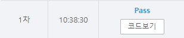

# [SWEA] 5249. [파이썬 S/W 문제해결 구현] 7일차 - 최소 신장 트리 [D4]

## 📚 문제

https://swexpertacademy.com/main/learn/course/lectureProblemViewer.do

---

## 📖 풀이

최소 신장 트리를 구하는 문제이다. 크루스칼 알고리즘을 풀어본다.

정점이 v + 1개이니 간선이 v개만큼 나왔을 때 종료한다.

## 📒 코드

```python
# 크루스칼 알고리즘
def find(x):        # root 값 찾기
    if parent[x] != x:
        parent[x] = find(parent[x])     # 경로 압축(부모 값을 루트 값으로 변경)
    return parent[x]    # root 값 return


def union(a, b):    # 합집합 - root 병합
    r_a = find(a)
    r_b = find(b)
    if r_a < r_b:       # root 값 바꿔주기(작은 수를 root로 합쳐준다)
        parent[r_b] = parent[r_a]
    else:
        parent[r_a] = parent[r_b]
    

t = int(input())
for tc in range(1, 1 + t):
    v, e = map(int, input().split())
    eges = sorted([list(map(int, input().split())) for _ in range(e)], key=lambda x: x[2])
    parent = [i for i in range(v + 1)]
    total_w = 0     # 최소신장트리를 가중치의 합
    cnt_e = 0       # 연결된 간선의 수

    for i in range(e):
        if cnt_e == v:      # 정점의 수가 v + 1이니 신장트리의 간선은 총 v개 나온다.
            break
        v1, v2, w = eges[i]
        if find(v1) == find(v2):    # root 값이 같은지 확인
            continue
        union(v1, v2)       # 병합
        total_w += w        # 가중치들을 더해준다.

    print(f'#{tc} {total_w}')
```

## 🔍 결과

