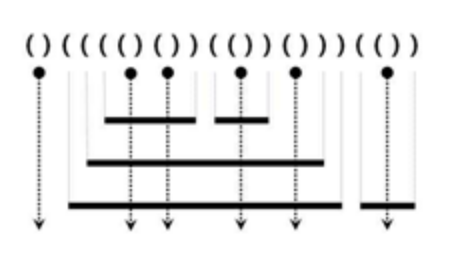

# [SWEA] 5432. 쇠막대기 자르기 [D4]

## 📚 문제

https://swexpertacademy.com/main/code/problem/problemDetail.do?contestProbId=AWVl47b6DGMDFAXm&categoryId=AWVl47b6DGMDFAXm&categoryType=CODE&problemTitle=5432&orderBy=FIRST_REG_DATETIME&selectCodeLang=ALL&select-1=&pageSize=10&pageIndex=1

---



표로 나타내어 어떤 패턴이 있는지 확인해본다. cnt는 괄호가 열리면 +1, 닫히면 -1을 해준다.

|        | (    | )    | (    | (    | (    | (    | )    | (    | )    | )    | (    | (    | )    | )    | (    | )    | )    | )    | (    | (    | )    | )    |
| ------ | ---- | ---- | ---- | ---- | ---- | ---- | ---- | ---- | ---- | ---- | ---- | ---- | ---- | ---- | ---- | ---- | ---- | ---- | ---- | ---- | ---- | ---- |
| cnt    | 1    | 0    | 1    | 2    | 3    | 4    | 3    | 4    | 3    | 2    | 3    | 4    | 3    | 2    | 3    | 2    | 1    | 0    | 1    | 2    | 1    | 0    |
| result |      | 0    |      |      |      |      | 3    |      | 3    | 1    |      |      | 3    | 1    |      | 2    | 1    | 1    |      |      | 1    | 1    |

> `(`가 나오면 `cnt += 1`
>
> `)`가 나오면 `cnt -= 1`
>
> `)`다음에 `)`가 연속으로 나오면 `result += 1`
>
> `( `다음에` )`가 나오면 `result += cnt'

result를 다 더하면 17로 정상적으로 출력된다.

## 📒 코드

```python
T = int(input())
for tc in range(1, T + 1):
    gwalho = ' ' + input()
    cnt = 0
    result = 0
    for i in range(1, len(gwalho)):
        if gwalho[i] == '(':   # cnt 1 증가
            cnt += 1
        else:
            cnt -= 1
            if gwalho[i-1] == '(':
                result += cnt
            else: result += 1
    print(f'#{tc} {result}')
```

## 🔍 결과 : Pass
