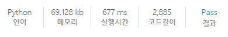

# [SWEA] 1242. [S/W 문제해결 응용] 1일차 - 암호코드 스캔 [D5]

## 📚 문제

https://swexpertacademy.com/main/code/problem/problemDetail.do?contestProbId=AV15JEKKAM8CFAYD&categoryId=AV15JEKKAM8CFAYD&categoryType=CODE&problemTitle=%EC%95%94%ED%98%B8%EC%BD%94%EB%93%9C+%EC%8A%A4%EC%BA%94&orderBy=FIRST_REG_DATETIME&selectCodeLang=ALL&select-1=&pageSize=10&pageIndex=1

---

문제가 체계적으로 풀어야하는 구현문제이다.

따라서 함수로 모듈화하여 푼다.

입력으로 들어오는 코드들이 16진수로 들어온다.

여러 줄의 입력이 들어오는 데 중복을 제거해서 받기 위해 리스트로 받고 set자료형으로 중복 제거 후 다시 리스트로 바꿔준다. 여기서 순서는 상관없으니 이렇게 해도 된다.

그리고 맨 오른쪽에 0은 제거한다. 왜냐면 코드는 맨 오른쪽이 무조건 1로 시작한다.

코드의 너비가 달라질 수 있다. 코드의 너비가 가장 얇을 때는 반복이 없을 때이니 56이다.

반복이 있으면 숫자가 중복되어 들어가니 56의 배수로 들어간다.

마지막의 숫자는 7개로 이루어져있는데 [0,1,0,1]의 조합으로 7개가 구성되어있다.

따라서 1이 들어올 때부터 cnt를 세서 수가 4번 바뀔 때까지 개수를 센다.

개수가 7개면 너비는 1이고, 14면 너비가 2이다.

처음에 1이 들어왔을 때 값을 기억해 암호를 해독한다.


암호해독은 다음을 참고한다.

### 📌 단순 2진 암호코드  

### https://velog.io/@yunhlim/SWEA-1240.-SW-%EB%AC%B8%EC%A0%9C%ED%95%B4%EA%B2%B0-%EC%9D%91%EC%9A%A9-1%EC%9D%BC%EC%B0%A8-%EB%8B%A8%EC%88%9C-2%EC%A7%84-%EC%95%94%ED%98%B8%EC%BD%94%EB%93%9C-D3

---

한 줄에 여러 개의 코드가 들어올 수 있으므로 암호를 0으로 바꾼 후 다시 오른쪽 0을 제거 후 다음 코드를 확인하다.

이 과정을 반복하며 정상적인 암호의 결과를 다 더해서 출력한다.

## 📒 코드

```python
def ten_to_binary(n):  # 10진수를 2진수로 변환
    ans = ''
    for i in range(4):  # 4자리
        ans = str(n % 2) + ans  # 나머지를 왼쪽에 붙여준다.
        n //= 2
    return ans


def hex_to_binary(n):
    ans = ''
    for c in n:  # 입력받은 16진수 순회
        if c.isdigit():  # 숫자인 경우
            ans += ten_to_binary(int(c))
        else:  # 문자인 경우 딕셔너리 활용
            ans += ten_to_binary(hex_c[c])
    return ans


def search_code():      # 메인 함수, 총 암호 해독 값의 합을 찾는다.
    total = 0
    for i in range(len(arr)):   # 줄 별로 확인
        arr[i] = hex_to_binary(arr[i])
        while arr[i]:    # ''만 남으면 보지않는다.
            e, width = code_status(i)       # 코드의 너비와 끝점을 받아온다.
            binary = arr[i][e - 56 * width + 1:e + 1: width]    # 코드 길이로 자르기
            if binary not in visited:    # 중복된 코드가 있으면 보지 않는다.
                total += solve_code(binary)
                visited.add(binary)
            arr[i] = arr[i][:e - 56 * width + 1].rstrip('0') # 확인한 코드는 제거 후 배열에서 오른쪽 0을 다 지운다.
    return total


def code_status(i):     # 너비와 끝점 찾는 함수
    cnt, e = 0, 0       # 암호의 길이와 끝점
    current = '0'       # 암호를 확인하고 값을 저장
    change = 0          # 네번 바뀌는지 파악하기 위한 변수
    for j in range(len(arr[i]))[::-1]:
        if current != arr[i][j]:
            if change == 4:  # 4번 바뀌면 종료
                break
            change += 1
            current = arr[i][j]
        if arr[i][j] == '1':
            if cnt == 0:
                e = j  # 끝 점 기억
            cnt += 1  # 1 개수 세기
        if cnt and arr[i][j] == '0':
            cnt += 1  # 0 개수 세기
    width = cnt // 7    # 7의 몇 배수인지 파악
    return e, width  # 끝점과 너비


def solve_code(code):  # 암호 시작점을 받아 해독한다.
    result = [0]  # 시작부분에 padding을 넣어준다.
    for i in range(8):  # 딕셔너리에 적은 코드와 같으면 그 값인 숫자로 넣어준다.
        result.append(d[code[0 + i * 7:(i + 1) * 7]])
    odd_sum, even_sum = 0, 0
    for i in range(1, 9):
        if i % 2:  # 홀수일 때와 짝수일 때 각각의 합을 찾는다.
            odd_sum += result[i]
        else:
            even_sum += result[i]

    if (odd_sum * 3 + even_sum) % 10:  # 계산 후 10으로 나누어 떨어지는지 판별
        return 0
    else:
        return sum(result)


d = {'0001101': 0, '0011001': 1, '0010011': 2, '0111101': 3, '0100011': 4, \
     '0110001': 5, '0101111': 6, '0111011': 7, '0110111': 8, '0001011': 9}
hex_c = {'A': 10, 'B': 11, 'C': 12, 'D': 13, 'E': 14, 'F': 15}
for tc in range(1, 1 + int(input())):
    n, m = map(int, input().split())
    arr = list(set([input().strip().rstrip('0') for _ in range(n)]))    # 오른쪽에 0 제거, set로 중복제거한 후 다시 리스트에 담는다.
    visited = set()     # 중복된 코드가 있는지 확인
    print(f'#{tc} {search_code()}')
```

## 🔍 결과

