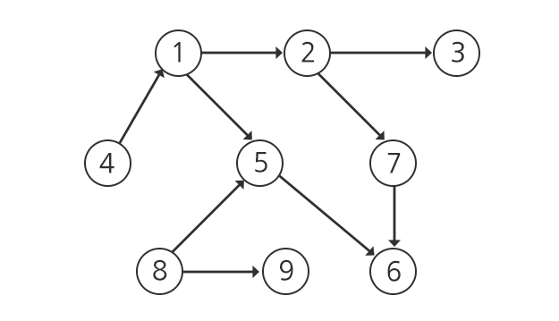

# [SWEA] 1267. [S/W 문제해결 응용] 10일차 - 작업순서 [D6]

## 📚 문제

https://swexpertacademy.com/main/code/problem/problemDetail.do?contestProbId=AV18TrIqIwUCFAZN&categoryId=AV18TrIqIwUCFAZN&categoryType=CODE&problemTitle=%EC%9E%91%EC%97%85%EC%88%9C%EC%84%9C&orderBy=FIRST_REG_DATETIME&selectCodeLang=ALL&select-1=&pageSize=10&pageIndex=1

---



다음과 같이 일을 할 수 있다. 일의 순서는 화살표 방향대로 해야한다. 

여기서 중요한 점은 4-> 1 -> 5 -> 8 같이 하면 안되므로 일을 할 때 무작정 화살표 방향대로 하면 안 되고, 그 정점으로 들어오는 간선이 없거나 있을 때는 연결된 정점들의 일이 해결했는지 확인해주어야 한다.

따라서 들어오는 간선에 관련된 리스트와 나가는 간선에 관한 리스트 두가지를 만들어야 하므로 3차원으로 배열을 만들어 [0], [1]에 각각 하나씩 담아준다.

정점들은 겹치는 수가 없으니 리스트가 아닌 **Set 자료형**에 담아준다.

재귀로 풀면 시행 횟수가 너무 많아져서 recursionerror가 뜨니 **BFS** 탐색으로 해결해본다.

먼저 들어 오는 간선이 없는 정점들을 찾아 큐에 담아 시작해준다.

큐는 **deque** 자료구조를 사용하여 만들어 준다.

위 그림에서는 4와 8을 큐에 담는다.

그리고 4, 8부터 순차적으로 연결된 정점들을 확인하며 진행해준다.

>1. 먼저 큐에서 값이 나오면 그 값이 출현 했는지 확인한다.
>
>   확인하기 위해 visited 리스트를 만들어 출현 했는지 확인 겸 순서대로 출력할 리스트를 만들어준다.
>
>2. 출현하지 않았으면 그 값에 연결된 간선이 없거나 혹시 있다면 visited 리스트에 있는지 확인한다.
>
>   위에 그림에서 5가 큐에서 나오면 일단 5의 작업을 했는지 확인하기 위해 visited에 있는지 확인하고 앞의 일들을 했는지 1, 8이 visited에 있는지도 확인해줘야한다.
>
>   확인하기 위해 들어오는 간선에 연결된 정점들의 집합을 set 자료형으로 만들어 놨으니 visited와 차집합을 활용해 쉽게 확인한다.
>
>3. 위 조건을 만족시키면 그 정점을 visited에 담아주고 정점에서 나가는 간선에 이어지는 정점들을 큐에 담아준다.

## 📒 코드

```python
from collections import deque

for tc in range(1, 11):
    V, E = map(int, input().split())
    # 정점(인덱스) => 정점들의 집합(set) , 정점(인덱스) <= 정점들의 집합(set)
    graph_lst = [[set() for _ in range(0, V+1)], [set() for _ in range(0, V+1)]] # 3차원으로 생성한다. 들어오는 경우, 나가는 경우
    in_lst = list(map(int,input().split())) # 입력
    queue = deque()         # BFS를 위해 queue 선언
    visited = []            # 탐색하여 순차적으로 담을 리스트
    for i in range(E):               
        graph_lst[0][in_lst[2*i]].add(in_lst[2*i+1]) # 정점 -> 정점 관계를 배열에 담아준다.
        graph_lst[1][in_lst[2*i+1]].add(in_lst[2*i]) # 정점 <- 정점 관계를 배열에 담아준다.
    for i in range(1, V+1): # 들어오는 간선이 없는 정점들만 택한다.
        if not graph_lst[1][i]:
            queue += [i]    # 찾은 정점들을 큐에 넣어준다.
    while queue:    # 큐에 값이 없으면 종료
        node = queue.popleft()  # 큐에서 하나씩 꺼내서 탐색한다.
        # 아직 한 번도 나오지 않았거나 들어오는 간선에 닿아있는 노드들이 다 출현한 경우
        if node not in visited and len(graph_lst[1][node]-set(visited)) == 0:   
            visited.append(node)    # 탐색한 걸 하나씩 담는다.
            queue += graph_lst[0][node] - set(visited) # 정점에서 연결된 정점들 중 아직 나오지 않는 정점들만 큐에 담는다.
    print(f'#{tc} ', end='')
    print(*visited)
```

## 🔍 결과 : Pass

처음에 재귀로 풀어 recurssion error가 떴다. 너무 시행 횟수가 많아 재귀로는 해결할 수 없는 문제였다. BFS 탐색으로 해결하니 쉽게 해결할 수 있었다.
