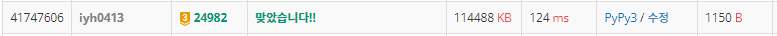

# [USACO] 2022_Mar. Alchemy [Bronze] [BOJ - 24982_G3]

## 📚 문제

https://www.acmicpc.net/problem/24982

---

## 📖 풀이

가장 숫자가 큰 금속을 재귀함수를 활용해 하나씩 만들어 보았었는데 시간초과가 발생하여 대회에서 시간 내에 못 풀었다..😢

여러 개씩 만들 수 있는지 재귀를 돌려보기 전에 확인할 수 없으니 이진 탐색을 통해 하나씩 만들기보단, **몇 개**를 만드는 것이 가능한지를 확인한다. 즉, **이진 탐색**을 활용한다.

이진 탐색을 할 경우 n이 답보다 적은 경우는 다 가능하고, 큰 경우는 불가능하다. 따라서 매개변수 탐색을 한다.

> oooooooxxxxxxxxx....

check를 했을 때 가능하면 왼쪽을 날리고, 불가능하면 오른쪽을 날려 가능한 값 중 가장 큰 값을 찾아 출력한다.

중요한 건 재귀로 개수를 완성할 수 있는지 찾는 것인데, 탑다운 함수로 구현한다.

1. 개수가 충분한 경우

   True를 리턴한다.

2. 개수가 불충분한 경우

   1. 불충분한데 만들 조합이 없는 경우

      만들 수 없으므로 False를 리턴한다.

   2. 불충분하지만 만들 조합이 있는 경우

      자식 노드들을 확인하면서 불충분한 개수만큼 만들 수 있는지 확인한다.

      만들 수 있으면 True를 리턴, 없으면 False를 리턴한다.

해당 값을 만들 때마다 만든 개수만큼 줄여줘야 한다. 따라서 입력된 금속들의 리스트는 함수를 입력하기 전에 원래 값으로 되돌려야한다. 따라서 입력된 리스트를 슬라이싱을 통해 얕은 복사 하여 사용한다. n이 최대 100이라 복사해도 시간이나 공간 복잡도 상 문제가 발생하지 않는다.

## 📒 코드

```python
import sys
input = sys.stdin.readline

def recur(metal, cnt):   # 필요한 개수를 재귀로 구현
    if visited[metal] >= cnt:   # 개수가 충분한 경우
        visited[metal] -= cnt
        return True
    if not graph[metal]:    # 원하는 개수가 충족되지 않았는데 만들 조합이 없는 경우 종료
        return False

    plus_cnt = cnt - visited[metal] # 개수가 충분하지 않지만 만들 조합이 있는 경우 확인
    for u in graph[metal]:
        if not recur(u, plus_cnt):  # 만들 수 없는 경우
            return False
    visited[metal] = 0              # 다 만들 수 있으면 0으로 만든다.
    return True


n = int(input().rstrip())
unit_cnt = [0] + list(map(int, input().split()))
k = int(input().rstrip())
graph = [[] for _ in range(n + 1)]  # i(금속) -> j(재료)

for _ in range(k):
    temp = list(map(int, input().split()))
    metal = temp[0]
    for material in temp[2:]:
        graph[metal].append(material)

s, e = 0, 10000000
ans = 0
while s <= e:   # 이진 탐색
    visited = unit_cnt[:]   # 입력된 개수를 복사
    mid = (s + e) // 2
    if recur(n, mid):
        ans = mid
        s = mid + 1
    else:
        e = mid - 1
print(ans)
```

## 🔍 결과

