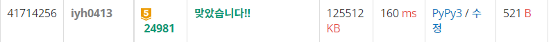

# [USACO] 2022_Mar. Counting Liars [BOJ - 24981_G5]

## 📚 문제 : [Counting Liars](https://www.acmicpc.net/problem/24981)

---

## 📖 풀이

sweeping 문제이다.

예제가 너무 부실하니 새로 하나 만들어본다.

- input

```
8
G 3
L 5
G 5
L 2
G 7
L 2
G 1
L 8
```

그림으로 표현해본다.


겹치는 구간 중 가장 큰 숫자만 파악하면 된다.

왜냐면 알려주는 소가 위처럼 8마리 중 5마리의 말이 겹치면 나머지 3마리가 거짓말을 한 경우가 가장 최소 값이기 때문이다.

위처럼 나오면 3이다.

그런데 지금 카운팅 배열을 사용해 값을 다 저장하면 시간초과가 발생할 수 밖에 없다. 범위가 0부터 10^9이기 때문에 다 저장하려면 시간초과가 발생한다.

따라서 **딕셔너리**를 활용해 값을 저장한다.

---

딕셔너리를 위 예제에서 어떤 식으로 적용하는 지 하나씩 확인해보자.

`dic = {}`으로 딕셔너리 배열을 초기화한다.

1. `G 3`이면 dic에 3보다 크거나 같은 수의 값을 1 증가시킨다. 없으니 새로운 값인 3만 `3:1`로 key와 값을 담아준다.

   `dic = {3:1}`

2. `L 5`이면 dic에 5보다 작거나 같은 수의 값을 1 증가시킨다. key가 3인 값이 있으니 1을 더해주고 값이 1인 5을 하나 추가해준다.

   `dic = {3:2, 5:1}`

3. 나머지도 위처럼 적용하면 아래와 같이 구할 수 있다.

   `{3: 4, 5: 5, 2: 5, 7: 5, 1: 5, 8: 5}`

4. 그러면 가장 큰 값인 5를 주어진 소의 수인 8에서 빼서 출력한다.

## 📒 코드

```python
import sys
input = sys.stdin.readline

n = int(input().rstrip())
arr = [input().split() for _ in range(n)]
dic = {}
for i in range(n):
    num = int(arr[i][1])
    dic[num] = 0

mmax = 0
for i in range(n):
    GL, num = arr[i]
    num = int(num)
    if GL == 'G':
        for k in dic:
            if k >= num:
                dic[k] += 1
                mmax = max(mmax, dic[k])
    else:
        for k in dic:
            if k <= num:
                dic[k] += 1
                mmax = max(mmax, dic[k])
print(n - mmax)
```

## 🔍 결과

