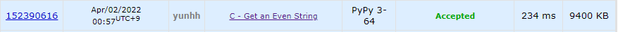

# [Codeforces] 1660C. Get an Even Strings [Codeforces Round #780 (Div. 3)]

## 📚 문제

https://codeforces.com/problemset/problem/1660/C

---

## 📖 풀이

대회에서는 1시간 가량 고민했지만 풀지 못했다.

문자열이 주어지면 짝수로 짝지어지는 문자열로 만들기 위해 최소 몇개의 문자를 지워야 하는지 구하는 문제이다.

- Input

```
6
aabbdabdccc
zyx
aaababbb
aabbcc
oaoaaaoo
bmefbmuyw
```

첫 번째 case인 `aabbdabdccc`는 `aabbddcc`로 만들면 된다. 연속으로 짝수개가 생기게 하면 되는 것이다.

두 번째 case인 `zyx`는 다 지우면 된다.


그럼 입력받은 문자열 앞에서부터 확인하며 배열에 그 문자열이 존재하지 않으면 배열에 담는다. 배열에 문자열이 존재하면 그 사이 값을 제거하면 되니까 배열에 있는 다른 문자들은 제거하는 것이다. 그리고 배열은 초기화한다.

위 과정을 예제로 설명해본다.

예제 1번을 보면 문자열이 a a b b d a b d c c c이다. 첫 문자열부터 하나씩 순회하며 구해본다.

1. a를 배열에 담는다. `[a]`
2. a가 배열에 있으니 다른 문자가 있는지 확인한다. 없으니 제거할 문자는 없고 배열도 초기화 한다.
3. b를 배열에 담는다. `[b]`
4. b가 배열에 있고 다른 문자는 배열에 없으니 배열을 초기화 한다.
5. d를 배열에 담는다. `[d]`
6. a를 배열에 담는다. `[a, d]`
7. b를 배열에 담는다. `[a, b, d]`
8. d가 배열에 있으니 a, b를 제거한 후 배열을 초기화 한다. (2개 제거)
9. c를 배열에 담는다. `[c]`
10. c가 배열에 있으니 배열을 초기화 한다.
11. c를 배열에 담는다. `[c]` 이게 마지막이니 c를 제거해야 한다. (총 3개 제거)

위 같은 방법으로 총 3개를 제거해야 함을 알 수 있다.

## 📒 코드

```python
t = int(input())
for _ in range(t):
    string = input()
    visited = []
    cnt = 0
    for i in string:
        if i in visited:
            cnt += len(visited) - 1
            visited = []
        else:
            visited.append(i)
    print(cnt + len(visited))
```

## 🔍 결과

