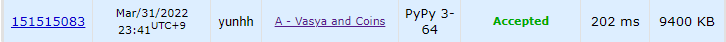

# [Codeforces] 1660A. Vasya and Coins [Codeforces Round #780 (Div. 3)]

## 📚 문제

https://codeforces.com/problemset/problem/1660/A

---

## 📖 풀이

대회의 첫 번째 문제이다. 제출까지 5분 정도 걸렸다.

1원짜리 동전과 2원짜리 동전의 개수가 주어질 때 잔돈을 낼 수 없는 가장 작은 자연수를 출력하라는 문제이다.

1원짜리가 없다면 무조건 답은 1원이 된다. 2원이 100000개가 있어도 1원이 답이다.

1원짜리가 하나 이상 있다면 답은 1원짜리에 2원짜리 개수 * 2 + 1을 한 수가 답이다.

따라서 1원짜리가 하나 이상 있으면 총 액수를 넘어설 때만 잔돈을 낼 수 없다.

## 📒 코드

```python
n = int(input())
for _ in range(n):
    a, b = map(int, input().split())
    if a == 0:
        print(1)
    else:
        print(a + 2 * b + 1)
```

## 🔍 결과

