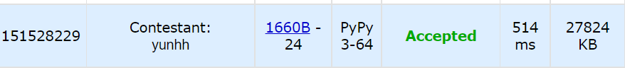

# [Codeforces] 1660B. Vlad and Candies [Codeforces Round #780 (Div.3)]

## 📚 문제 : [Vlad and Candies](https://codeforces.com/problemset/problem/1660/B)

---

## 📖 풀이

첫째 줄에 사탕의 종류와 둘째 줄에 사탕의 개수가 주어진다.

같은 사탕을 연속으로 고르지 않고 사탕을 하나씩 모두 고를 수 있는지 묻는 문제이다.

처음에 생각하기 어려웠지만, 처음 먹는 순간 가장 많은 수의 캔디와 두 번째로 많은 수의 캔디만 1개 이하로 차이가 난다면 모든 캔디를 먹을 수 있다.

100 99 4 이렇게 주어진다고 해도 나머지 캔디들은 어차피 번갈아 먹으며 없앨 수 있으므로 상관 없다.

따라서 캔디의 종류가 하나 있는 경우와 캔디의 종류가 두 개 이상 있는 경우로 나눈다.

- 캔디의 종류가 하나 있는 경우
  - 캔디의 개수가 하나면 `YES`
  - 캔디의 개수가 두 개 이상이면 안되니 `NO`
- 캔디의 종류가 두 개 이상 있는 경우
  - 우선 캔디를 정렬한다.
  - 캔디 중 가장 많은 캔디의 개수와 두 번째로 많은 캔디의 개수 차이가 1이하면 `YES`
  - 가장 많은 캔디의 개수와 두번째로 많은 캔디의 개수 차이가 1보다 크면 `NO`

## 📒 코드

```python
t = int(input())
for _ in range(t):
    n = int(input())
    arr = list(map(int, input().split()))
    arr.sort()
    if len(arr) == 1:
        if arr[0] == 1:
            print('YES')
        else:
            print('NO')
    elif arr[-1] - arr[-2] > 1:
        print('NO')
    else:
        print('YES')
```

## 🔍 결과

