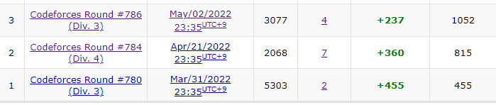
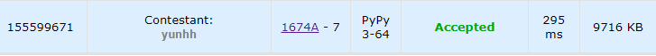
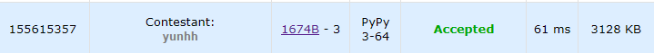
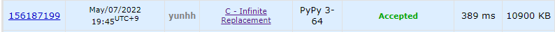
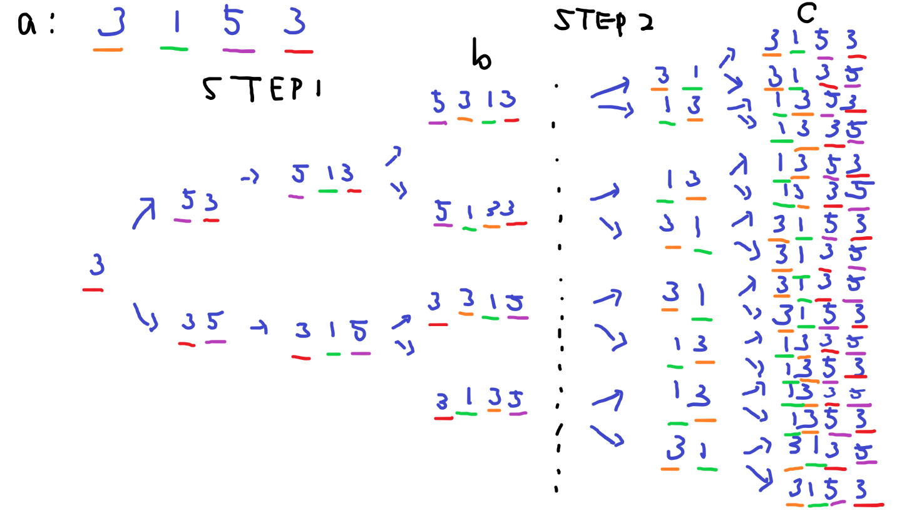
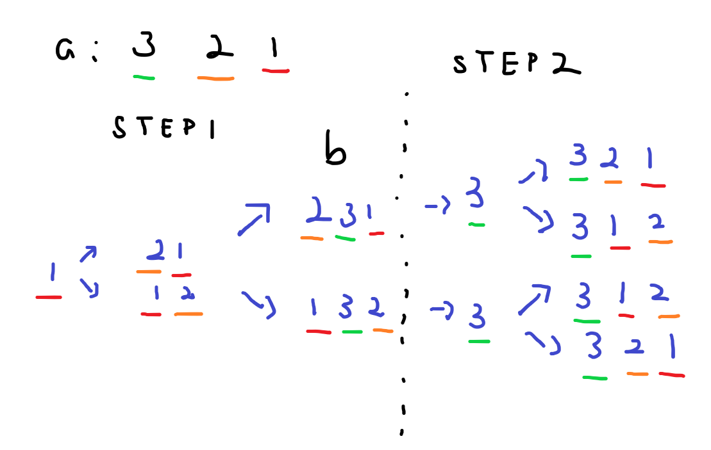
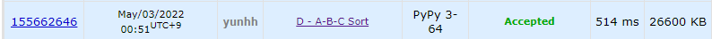
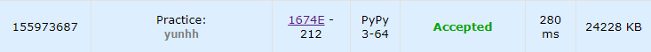

# [Codeforces] Round #786 (Div. 3)

세 번째 코드포스 대회이다.

A~D 4문제를 해결해 237 point가 상승했다.

E번은 풀다가 막혀 나중에 업솔빙했다.

좀 더 많이 풀어보면서 푸는 속도를 늘려야겠다. 영어 문제를 푸려고 하니 문제 이해하는데 시간이 많이 소요된다.😅😅



---

## 📚 문제 A : [Number Transformation](https://codeforces.com/contest/1674/problem/A)

## 📖 풀이 A

1보다 크거나 같은 두 정수 x와 y가 주어진다.

a와 b는 1보다 크거나 같은 정수인데 x를 a번 b * x로 바꾼다고 한다.

그러면 (b ** a) * x로 바뀌는 것이다.

따라서 임의의 수 a와 b로 x를 만든다는 것이니 사실 a와 b의 값은 중요하지 않다.

y가 되기 위해 x에 정수를 곱해서 만들 수 있는지 찾는 문제이다.

따라서 y가 x로 나누어 떨어지는지 구하고 그 때의 a는 1, b는`y // x`로 출력하면 된다.

나누어 떨어지지 않으면 `0, 0`을 출력한다.

## 📒 코드 A

```python
t = int(input())
for _ in range(t):
    x, y = map(int, input().split())
    if y // x != y / x:
        print(0, 0)
    else:
        print(1, y // x)
```

## 🔍 결과 A



---

## 📚 문제 B : [Dictionary](https://codeforces.com/contest/1674/problem/B)

## 📖 풀이 B

사전 순으로 배열하는 문제이다.

이 때 중복되는 문자가 없으니 숫자를 셀 때 제거하고 세는 것이 중요하다.

`ord()`를 활용해 `ord('a')`로 알파벳 a로부터의 차이를 숫자로 바꿔준다.

앞에 오는 문자가 뒤에 문자보다 큰지 작거나 같은지에 따라 달라지니 if 문으로 분기처리하였다.

## 📒 코드 B

```python
t = int(input())
for _ in range(t):
    result = 0
    word = input()
    result += 25 * (ord(word[0]) - ord('a'))
    if ord(word[1]) > ord(word[0]):
        result += ord(word[1]) - ord('a')
    else:
        result += ord(word[1]) - ord('a') + 1
    print(result)
```

## 🔍 결과 B



---

## 📚 문제 C : [Infinite Replacement](https://codeforces.com/contest/1674/problem/C)

## 📖 풀이 C

a로만 이루어진 문자열이 s랑, 다양한 소문자로 구성된 문자열 t가 주어진다.

s의 문자열 중 하나를 임의로 문자열 t로 바꿀 수 있을 때, 만들 수 있는 문자열의 개수를 출력하는 문제이다.

1. t에 'a'가 없는 경우

   s가 aaa라고 하면,

   aaa, aat, ata, att, taa, tat, tta, ttt : 8가지가 나온다.

   즉, t에 문자들이 어떻게 들어오든 'a'만 없다면, s의 각 자릿수를 조합으로 뽑는 경우와 같다.  2^(s의 길이)가 답이 된다.

2. t에 'a'가 있는 경우

   1. t가 'a'인 경우

      t가 'a' 하나만 있다면, 답은 무조건 1이다. 바꿔주든 안바꿔주든 원래 모습인 s 하나만 있기 때문이다.

   2. t가 'a'로만 이루어져있지만 'a'는 아닌 경우(ex. 'aa', 'aaaa')

      이 경우엔 무한대로 커지기 때문에 답은 -1이다.

   3. t가 'a'와 다른 문자가 섞여있는 경우

      이 경우도 무한대로 계속 확장되므로 답은 -1이 된다.

## 📒 코드 C

```python
t = int(input())
for _ in range(t):
    s = input()
    t = input()
    if 'a' in t:
        if len(t) == 1:
            print(1)
        else:
            print(-1)
    else:
        print(2 ** (len(s)))
```

## 🔍 결과 C



---

## 📚 문제 D : [A-B-C Sort](https://codeforces.com/contest/1674/problem/D)

## 📖 풀이 D

이 문제는 예제를 손으로 적어가며 해결방법을 찾았다.



예제로 a가 3 1 5 3으로 주어지면 3과 1의 자리를 바꾸고 5와 3의 자리를 바꾸는 경우만 c로 출력된다. 따라서 짝수인 경우는 2개씩 자리를 바꾸거나 안바꾸는 경우 정렬한 수와 같은지 비교하면 된다.

홀수일 때도 되는지 확인해본다.



홀수일 때는 앞의 수 하나는 자리가 안바뀌고 두 번째 수부터 자리를 2개씩 변환 가능하다.

따라서 뒤부터 2개씩 확인하며 자리를 바꾸었을 때 정렬한 수랑 똑같이 만들 수 있는지 확인한다. 홀수인 경우, index 0을 확인하는데 이 땐 두 자리가 아닌 정렬한 수의 첫번째 인덱스와만 비교하여 같은지 판단한다.

## 📒 코드 D

```python
def check():
    for i in range(n)[::-2]:
        if i == 0:
            if a[i] == sort_a[i]:
                continue
            else:
                return('NO')
        elif a[i] == sort_a[i] and a[i - 1] == sort_a[i - 1]:
            continue
        elif a[i] == sort_a[i - 1] and a[i - 1] == sort_a[i]:
            continue
        else:
            return('NO')
    return('YES')


t = int(input())
for _ in range(t):
    n = int(input())
    a = list(map(int, input().split()))
    sort_a = sorted(a)
    print(check())
```

## 🔍 결과 D



---

## 📚 문제 E : [Breaking the Wall](https://codeforces.com/contest/1674/problem/E)

## 📖 풀이 E

벽 부수는 문제이다.

벽이 일렬로 나열되어 있는데 타겟하는 벽은 2의 데미지를 입고, 이웃하는 벽은 1의 데미지를 입는다.

최소한의 타격으로 2개의 벽을 깰 수 있는 횟수를 출력한다.

엄청 오랫동안 업솔빙했던 문제이다.

3가지로 나누어서 해결했다.

1. 이웃하는 벽을 최소한의 횟수로 깨는 경우
2. 하나의 벽을 사이로 두고 떨어져있는 벽을 부수는 경우
3. 둘 이상의 벽을 사이로 두고 떨어져있는 벽을 부수는 경우

이 중 이웃하는 벽을 부수는 경우가 까다로웠다.

3번은 모든 벽마다 타겟하는 벽으로 쏴 부술 수 있는 최소의 경우를 배열에 담았다. 배열에는 횟수가 가장 적은 2개만을 계속 담고, 모든 벽을 탐색하며 두 가지 벽보다 작은 경우 바꾸는 방법으로 담았다. 이웃하는 경우도 담게되지만, 어차피 그 때 구하는 방법으로 해결했을 때 답이 더 작으면 갱신되니 상관없다. 벽의 내구성을 2로 나눈 몫과 나머지를 더해서 구한다.

2번은 1칸의 벽을 두고 떨어져있는 경우를 구하는 것이다. 두 벽의 내구성이 홀수인 경우만 구했다. 왜냐면 3번을 부수는 방법에서 두 벽의 내구성이 하나라도 짝수인 경우는 값이 같게되기 때문에 굳이 구해줄 필요는 없다. 왜냐면 두 벽이 홀수여야만 가운데 벽을 부수는 하나의 방법이 더해져 가치가 생긴다. 이 때의 값은 두 벽의 내구성을 합치고 2로 나눈 몫과 나머지를 더해서 구한다.

1번은 이웃하는 벽을 부수는 경우이다. 이 때 두 벽 중 하나의 내구성이 다른 내구성의 2배보다 크거나 같으면 큰 쪽만 다 부수는 경우를 구하면 된다. 큰 쪽의 내구성을 2로 나눈 몫과 나머지를 더해서 구한다.

1번 중 하나의 내구성이 다른 내구성의 2배보다 작으면 두 내구성이 같아질 때까지 먼저 큰 쪽을 부순다. 같게되면 2번을 구했던 방법을 사용하면 된다. 다른 점은 데미지가 2, 1로 나누어서 들어가니 3으로 나눈 몫과 3으로 나눈 나머지를 더한다.

## 📒 코드 E

```python
n = int(input())
arr = list(map(int, input().split()))
min_two = [100000000, 100000000]    # 따로 떨어진 벽의 파괴 횟수
result = 100000000
for i in range(n):
    # 두 벽이 붙어있는 경우
    if i < n - 1:
        x, y = arr[i], arr[i + 1]
        big, small = max(x, y), min(x, y)
        if big < small * 2:
            cnt = big - small       # 내구성이 같아질 때까지
            big -= cnt * 2
            small -= cnt
            cnt += (big + small) // 3 + (1 if (big + small) % 3 else 0) # 내구성이 같으면 3으로 나눈다.
            result = min(result, cnt)
        else:               # 큰 쪽이 작은 쪽 * 2보다 크거나 같을 때
            result = min(result, big // 2 + big % 2)
    # 따로 떨어진 벽을 깨는 경우(1칸 이상)
    min_two.append(arr[i] // 2 + arr[i] % 2)
    min_two = sorted(min_two)[0:2]      # 가장 작은 횟수 2개만 남긴다.

    # 1칸의 벽을 사이에 두고 떨어져있는 경우(두 벽의 내구성이 홀수인 경우만)
    if 0 < i < n - 1 and arr[i - 1] and arr[i + 1]:
        total = arr[i - 1] + arr[i + 1]
        cnt = total // 2 + total % 2
        result = min(result, cnt)

result = min(sum(min_two), result)      # 벽이 떨어져있는 경우를 결과값과 비교
print(result)
```

## 🔍 결과 E

