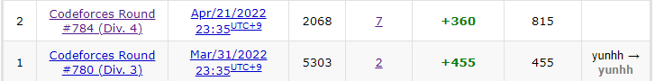
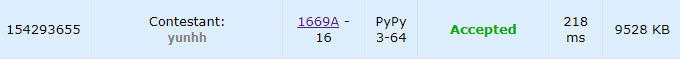
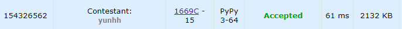
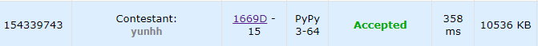
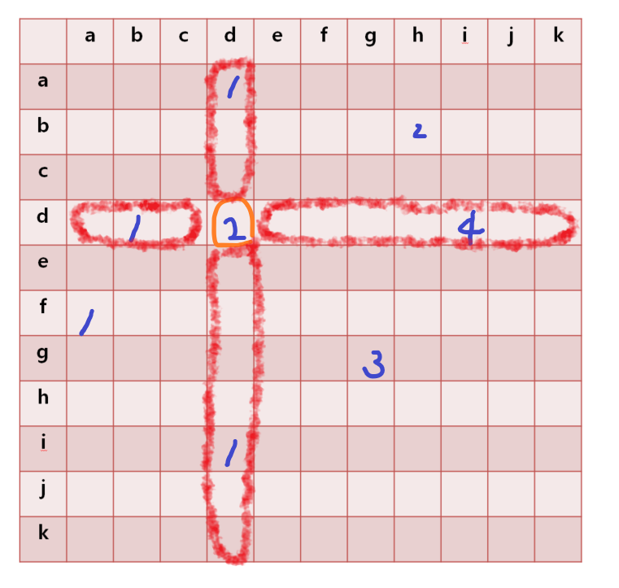
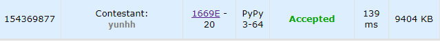
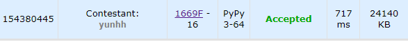
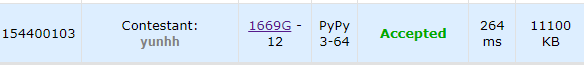
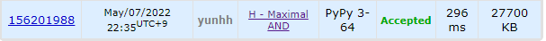

# [Codeforces] Round #784 (Div. 4)

Div.4 대회가 열어 참가했다. 다 풀 수 있을 거 같았는데 H 하나 못 풀었다. 

중간에 문제 이해를 잘못해서 시간 안에 해결하지 못해 아쉽다.😢



---

## 📚 문제 A : [Division?](https://codeforces.com/contest/1669/problem/A)

그냥 조건문 활용하는 쉬운 문제라 풀이는 생략한다.

## 📒 코드 A

```python
t = int(input())

for i in range(t):
    x = int(input())
    if x >= 1900:
        print('Division 1')
    elif x >= 1600:
        print('Division 2')
    elif x >= 1400:
        print('Division 3')
    else:
        print('Division 4')
```

## 🔍 결과 A



---

## 📚 문제 B : [Triple](https://codeforces.com/contest/1669/problem/B)

## 📖 풀이 B

입력으로 주어진 배열에 같은 수가 3개 이상 있는지 확인하는 문제이다.

딕셔너리를 활용해 같은 값이 들어오면 1씩 더하고, 없는 값이 들어오면 값을 1로 넣어준다.

3개가 되는 순간 그 값을 출력한다.

## 📒 코드 B

```python
t = int(input())
for _ in range(t):
    n = int(input())
    arr = list(map(int, input().split()))
    dic = {}
    for i in range(n):
        dic[arr[i]] = dic.get(arr[i], 0) + 1
        if dic[arr[i]] == 3:
            print(arr[i])
            break
    else:
        print(-1)
```

## 🔍 결과 B


---

## 📚 문제 C : [Odd/Even Increments](https://codeforces.com/contest/1669/problem/C)

## 📖 풀이 C

짝수를 다 1씩 더하거나, 홀수를 다 1씩 더하는 연산을 할 수 있다. 연산을 한 후 다 짝수이거나 다 홀수인 경우는 YES를 출력하고 아니면 NO를 출력하는 문제이다.

인덱스가 짝수인 배열은 모두 짝수거나 홀수여야 하고, 인덱스가 홀수인 배열도 모두 짝수거나 홀수로 같아야 한다.

따라서 인덱스가 0일 때와 나머지 짝수 인덱스에서의 값들이 2로 나눈 나머지가 다 같으면 되고, 인덱스가 1일 때와 나머지 홀수 인덱스에서의 값들을 2로 나눈 나머지가 다 같으면 된다.

## 📒 코드 C

```python
t = int(input())
for _ in range(t):
    n = int(input())
    arr = list(map(int, input().split()))
    
    for i in range(2, n):
        if arr[i % 2] % 2 != arr[i] % 2:
                print('NO')
                break
    else:
        print('YES')
```

## 🔍 결과 C



---

## 📚 문제 D : [Colorful Stamp](https://codeforces.com/contest/1669/problem/D)

## 📖 풀이 D

W로만 이루어진 배열을 입력으로 받은 배열의 모양으로 바꿀 수 있는지 구하는 문제이다. 

이웃하는 배열의 모양을 BR 스탬프를 활용해, BR이나 RB로 바꿔줄 수 있다.

규칙을 찾아본다.

'W'말고 R과 B로만 구성되어있는 경우는 길이가 1이 아니고 하나의 색으로만 구성되지 않으면 모두 만들 수 있다. 어차피 2가지 색이 들어있으면 길이는 1이 아니다.

따라서 'W' 사이에 R과 B가 하나 이상씩 있는지 확인한다.

앞에서부터 배열을 보며, 'W'가 아닌 문자가 나오면 set() 자료형에 담는다. 

'W'가 나오거나, 마지막 문자에 도달하면 set()에 2개가 있는지 확인한다. 없으면 NO를 출력한다.

## 📒 코드 D

```python
t = int(input())
for _ in range(t):
    n = int(input())
    arr = input()
    store = set()
    for i in range(n):
        if arr[i] == 'W':
            if len(store) == 1:
                print('NO')
                break
            store = set()
        else:
            store.add(arr[i])
    else:
        if len(store) != 1:
            print('YES')
        else:
            print('NO')
```

## 🔍 결과 D



---

## 📚 문제 E : [2-Letter Strings](https://codeforces.com/contest/1669/problem/E)

## 📖 풀이 E

입력으로 2개의 소문자로 이루어진 문자들이 주어진다.

문자들을 2개씩 조합할 때, 하나의 자릿수만 같게 될 때의 조합의 총 개수를 출력하는 문제이다.

a부터 k까지의 소문자로 이루어지니 딕셔너리를 이용해 0 ~ 10에 대응시켜 2차원 배열에 카운팅 배열로 사용한다. 배열의 1차원에는 첫번째 문자, 2차원의 값에는 두번째 문자를 대응시킨다.



`dd`가 2개 있고 `dd`와 한 자리 차이나는 문자들을 확인한다. 여기서 빨강으로 칠해진 부분이다. 총 7개이다.

`dd`인 2에 하나 차이나는 문자들의 개수인 7을 곱한 14를 result 변수에 더해준다.

모든 배열을 담고 그 때 값이 1보다 크거나 같을 때, 1차이나는 모든 수들의 합을 더해 곱한다음 result에 담아주면된다.

## 📒 코드 E

```python
import sys
input = sys.stdin.readline


t = int(input())
dic = {'a':0, 'b':1, 'c':2, 'd':3, 'e':4, 'f':5, 'g':6, 'h':7, 'i':8, 'j':9, 'k':10}
for _ in range(t):
    n = int(input())
    arr = [input().rstrip() for _ in range(n)]
    matrix = [[0] * 11 for _ in range(11)]
    for i in range(n):
        matrix[dic[arr[i][0]]][dic[arr[i][1]]] += 1
    total = 0
    for i in range(11):
        for j in range(11):
            if matrix[i][j] > 0:
                for i2 in range(i + 1, 11):
                    total += matrix[i][j] * matrix[i2][j]
                for j2 in range(j + 1, 11):
                    total += matrix[i][j] * matrix[i][j2]
    print(total)
```

## 🔍 결과 E



---

## 📚 문제 F : [Eating Candies](https://codeforces.com/contest/1669/problem/F)

## 📖 풀이 F

투포인터를 활용한다. 왼쪽 끝과 오른쪽 끝에서 시작한다.

왼쪽부터 무게의 합과 오른쪽부터 무게의 합을 구해서 더 작은 쪽이 사탕을 하나씩 더 먹으면서 전진한다.

두 무게가 같아지는 경우 그 때의 개수를 total에 저장한다.

그리고 다시 움직이며 무게가 또 같아지는 경우가 있는지 확인한다. 그러면 그 때 개수를 또 갱신한다.

두 포인터가 만나면 종료한다.

## 📒 코드 F

```python
t = int(input())
for _ in range(t):
    n = int(input())
    arr = list(map(int, input().split()))
    s, e = 0, n - 1
    s_sum = arr[s]
    e_sum = arr[n - 1]
    cnt = 2
    total = 0
    while s < e:
        if s_sum == e_sum:
            total += cnt
            s_sum, e_sum = 0, 0
            cnt = 1
            s += 1
            s_sum += arr[s]
        elif s_sum > e_sum:
            cnt += 1
            e -= 1
            e_sum += arr[e]
        else:
            cnt += 1
            s += 1
            s_sum += arr[s]

    print(total)
```

## 🔍 결과 F



---

## 📚 문제 G : [Fall Down](https://codeforces.com/contest/1669/problem/G)

## 📖 풀이 G

구현 문제이다.

`.`은 빈 공간이고 `*`은 떨어지는 돌이다. `o`은 구조물로 돌이 위에서 떨어지면 구조물 위에 멈춘다.

돌이 떨어질 때 막는 구조물이 없으면 맨 아래부터 쌓인다.

세로 축을 기준으로 확인하면서 돌이 있으면 구조물 위로 쌓게 하고, 없으면 맨 아래부터 쌓이게 코드를 짠다.

## 📒 코드 G

```python
t = int(input())
for _ in range(t):
    n, m = map(int, input().split())
    arr = [list(input()) for _ in range(n)]

    for j in range(m):
        cnt = 0
        s = 0
        for i in range(n):
            if arr[i][j] == 'o':
                if cnt:
                    for k in range(s, i)[::-1]:
                        if cnt:
                            arr[k][j] = '*'
                            cnt -= 1
                        else:
                            arr[k][j] = '.'
                s = i + 1
            elif arr[i][j] == '*':
                cnt += 1
        else:
            if cnt:
                for k in range(s, i + 1)[::-1]:
                    if cnt:
                        arr[k][j] = '*'
                        cnt -= 1
                    else:
                        arr[k][j] = '.'
    for i in range(n):
        print(''.join(arr[i]))
```

## 🔍 결과 G



---

## 📚 문제 H : [Maximal AND](https://codeforces.com/contest/1669/problem/H)

## 📖 풀이 H

대회 시간 안에 해결하지 못해 업솔빙한 문제이다.

간단한 비트마스킹 문제였다. 영어로 적혀있어 아직 문제 해석하는데 실수를 너무 많이한다.

비트 쉬프트 연산자 `<<` 와 비트 and 연산자인 `&`을 활용한다.

2의 30 제곱까지 입력이 주어지니 0~30까지의 비트 카운팅 배열을 만든다.

모든 입력의 비트를 `if arr[i] & (1 << j):`로 조회하여 있으면 카운팅 배열에 추가해준다.

카운팅 배열을 뒤부터 확인하며, 남아있는 k로 n개만큼 카운팅 배열에 채워줄 수 있으면 채우고 그 때의 값을 result에 넣어준다.

## 📒 코드 H

```python
t = int(input())
for _ in range(t):
    n, k = map(int, input().split())
    arr = list(map(int, input().split()))
    count = [0 for _ in range(31)]

    for i in range(n):
        for j in range(31):
            if arr[i] & (1 << j):
                count[j] += 1
    
    result = 0
    for i in range(31)[::-1]:
        if count[i] + k >= n:
            result += 1 << i
            k -= n - count[i]
    print(result)
```

## 🔍 결과 H

