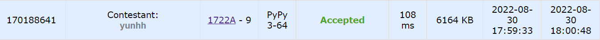
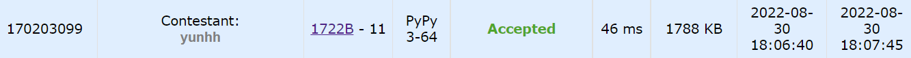
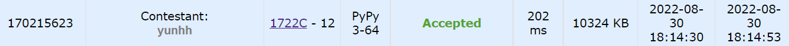
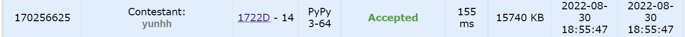
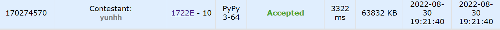
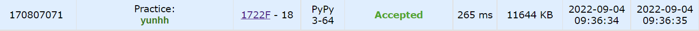

# [Codeforces] Round #817 (Div.4)

## 📚 문제 A: [Spell Check](https://codeforces.com/problemset/problem/1722/A)

## 📖 풀이

Timur의 이름의 순서만 바뀌었는지 확인하고 그렇다면 YES를 출력하는 문제이다.

T는 무조건 대문자이고 나머지 imur는 소문자여야 한다.

그리고 글자 수는 무조건 5여야 하니 일단 5가 아닌 문자열이 들어오면 NO를 출력한다.

글자수가 5개이면 visited 배열에 하나씩 담아준다.

똑같은 글자가 나오면 NO를 출력한다.

그리고 Timur 안에 있는 글자가 나오면 visited 배열에 담아준다.

따라서 Timur와 같은 문자열이 있는지 visited 배열로 확인하고 중복된 값이 존재하는 지도 판별할 수 있다.

## 📒 코드

```python
t = int(input())
name = 'Timur'
for _ in range(t):
    n = int(input())
    string = input()
    if n != 5:
        print('NO')
        continue
    visited = set()
    for c in string:
        if c in visited or c not in name:
            print('NO')
            break
        visited.add(c)
    else:
        print('YES')
```

## 🔍 결과



---

## 📚 문제 B : [Colourblindness](https://codeforces.com/problemset/problem/1722/B)

## 📖 풀이

적녹 색맹이라 green과 blue를 구별하지 못한다.

입력으로 주어진 두 문자열이 적녹 색맹 입장에서 봤을 때 같은 문자열인지 판단하는 문제이다.

따라서 두 문자열 중 blue를 green으로 다 바꿔준다.(반대로 해도 된다.)

그리고 비교해 같은지 판단한다.

## 📒 코드

```python
t = int(input())
for _ in range(t):
    n = int(input())
    up_row = list(map(lambda x: 'G' if x == 'B' else x, input()))
    down_row = list(map(lambda x: 'G' if x == 'B' else x, input()))
    if up_row == down_row:
        print('YES')
    else:
        print('NO')

```

## 🔍 결과



---

## 📚 문제 C : [Word Game](https://codeforces.com/problemset/problem/1722/C)

## 📖 풀이

세 사람이 n개 만큼 중복되지 않는 3길이의 단어들을 적는다.

서로 중복되게 적었는지는 확인할 수 없고, 본인이 적는 단어들을 중복없이 적는 것이다.

그리고 확인한 결과 자신이 적은 단어가 다른 사람이 적지 않았으면 +3점

두 명이 서로 중복됐으면 +1점

세 명 다 같은 단어를 적었으면 0점이다.

따라서 딕셔너리를 활용해 단어를 key로 나온 횟수를 value로 적어준다.

그리고 한 명씩 확인하면서, 단어가 나온 횟수가 1이면 +3, 2이면 +1로 점수를 올려준다.

세 사람 다 구한 후 점수를 순서대로 출력한다.

## 📒 코드

```python
t = int(input())
for _ in range(t):
    n = int(input())
    arr_a = list(input().split())
    arr_b = list(input().split())
    arr_c = list(input().split())
    dic = {}
    score = [0, 0, 0]
    for x in arr_a:
        dic[x] = dic.get(x, 0) + 1
    for x in arr_b:
        dic[x] = dic.get(x, 0) + 1
    for x in arr_c:
        dic[x] = dic.get(x, 0) + 1

    for x in arr_a:
        if dic[x] == 1:
            score[0] += 3
        elif dic[x] == 2:
            score[0] += 1
    for x in arr_b:
        if dic[x] == 1:
            score[1] += 3
        elif dic[x] == 2:
            score[1] += 1
    for x in arr_c:
        if dic[x] == 1:
            score[2] += 3
        elif dic[x] == 2:
            score[2] += 1

    print(*score)

```

## 🔍 결과



---

## 📚 문제 D: [Line](https://codeforces.com/problemset/problem/1722/D)

## 📖 풀이

사람들을 1열로 세운다.

1열로 세운 사람들이 L, R로 왼쪽과 오른쪽을 바라보고 선다.

바라봤을 때 나오는 사람의 숫자만큼 세서 더해준다.

사람이 총 n명이면, 1~n번 사람의 방향을 최대로 바꿔 나올 수 있는 최대 값을 출력한다.

무조건 n번 지나면 가장 많이 셀 수 있도록 사람들의 방향이 지정이 된다.

문제를 풀기 위해 알아야 할 포인트는 **가장자리의 사람부터 바꿔준다.(바꿀 수 없으면 pass)**

그래서 일단 중심 값을 구하고 투 포인터로 맨 앞과 맨 뒤 사람들의 위치를 기억해 바꿔서 커질 수 있으면 바꿔준다.

맨 앞을 s, 맨 뒤를 e로 정하고 s와 e 중 중심값에서 먼 사람부터 확인한다.

확인한 결과 사람의 방향을 바꿨을 때 더 커질 수 있다면 바꾸고, 아니면 바꾸지 않는다.

이 때, 중심보다 앞에 있는 경우는 왼쪽을 바라보는 경우보다 오른쪽을 바라보는 경우에 값이 더 커진다. 따라서 왼쪽을 바라보고 있는 경우만 바꿔주면 된다.

중심보다 뒤에 있는 경우는 위와 반대로 오른쪽을 바라보고 있는 경우만 왼쪽으로 바꿔준다.

result를 n개 만큼 배열을 만들어 1~n 번 바꿔준 경우의 결과를 담을 것이다. 0으로 초기화 한다.

result에 하나씩 담아주고, 더이상 바꿔줄 수가 없다면 종료한다.

result에 그러면 0이 남는 경우가 발생하는 데, 이 때는 현재 나온 total 값을 담아주면 된다.(지금까지 구한 total 값이 최대 나올 수 있는 total 값이다.)

그리고 result를 언패킹 연산자를 활용해 출력한다.

## 📒 코드

```python
t = int(input())
for _ in range(t):
    n = int(input())
    arr = input()
    ans = [0 for _ in range(n)]     # 각 자리 수
    for i in range(n):
        if arr[i] == 'L':
            ans[i] = i
        else:
            ans[i] = n - i - 1
    result = [0 for _ in range(n)]  # k에 따른 각 자리 수의 합
    total = sum(ans)
    k = 0
    s, e = 0, n - 1
    mid = (s + e) // 2
    while s <= e and k < n:
        if mid - s >= e - mid:
            if ans[s] == s:
                total -= ans[s]
                ans[s] = n - s - 1
                total += ans[s]
                result[k] = total
                k += 1
            s += 1
        else:
            if ans[e] == n - e - 1:
                total -= ans[e]
                ans[e] = e
                total += ans[e]
                result[k] = total
                k += 1
            e -= 1
    # 나머진 total 값을 넣어준다.
    for i in range(n)[::-1]:
        if result[i] == 0:
            result[i] = total
        else:
            break
    print(*result)

```

## 🔍 결과



---

## 📚 문제 E: [Counting Rectangles](https://codeforces.com/problemset/problem/1722/E)

## 📖 풀이

카운팅 배열 및 2차원 누적합 문제이다.

1001 * 1001로 배열 visited를 만들어 사각형의 h * w를 `visited[h][w]`에 담아준다.

n이 10만까지이고 q도 10만까지이니 h, w는 1000까지니까 카운팅 배열을 활용해야 한다. 그냥 하나씩 확인하려고 하면 O(n^2)으로 무조건 시간초과가 발생한다.

카운팅 배열로 담아주고 q만큼 확인해주려고 해도 시간초과가 발생한다.

따라서 시간을 현저히 줄이기 위해 2차원 누적합을 활용한다.

[백준 - 14846. 직사각형과 쿼리](https://velog.io/@yunhlim/Baekjoon-14846.-%EC%A7%81%EC%82%AC%EA%B0%81%ED%98%95%EA%B3%BC-%EC%BF%BC%EB%A6%AC-G4)를 참고한다.

위 방법과 같이 누적합을 활용하면 쿼리 하나씩 확인하는 연산을 2중 for 문 최대 1000 * 1000 = 10만에서 4로 줄일 수 있다.

## 📒 풀이

```python
t = int(input())
for _ in range(t):
    n, q = map(int, input().split())
    visited = [[0 for _ in range(1001)] for _ in range(1001)]
    for i in range(n):
        hi, wi = map(int, input().split())
        visited[hi][wi] += hi*wi
    # 2차원 누적합
    for i in range(1, 1001):
        for j in range(1, 1001):
            visited[i][j] = visited[i][j] + visited[i-1][j] + \
                visited[i][j-1] - visited[i-1][j-1]

    for i in range(q):
        hs, ws, hb, wb = map(int, input().split())
        ans = visited[hb - 1][wb - 1] - visited[hb - 1][ws] - \
            visited[hs][wb - 1] + visited[hs][ws]
        print(ans)

```

## 🔍 결과



---

## 📚 문제 F: [L-shapes](https://codeforces.com/problemset/problem/1722/F)

## 📖 풀이

대회 중에는 테스트 케이스는 다 맞게끔 풀었는데 히든 케이스에서 틀렸던 문제이다.

**DFS로 L모양으로 이루어져있는지 파악한다.**

1. DFS로 연결된 개수가 3개인지 확인한다.
2. 연결된 타일들을 확인할 때 그 때의 방향을 기억해 담아준다.
3. 확인했던 방향을 또 확인하면 일자로 3개가 붙는 경우이니 이 때를 처리해준다.(나는 같은 방향이 또 나오면 4를 리턴해 3개가 아닌 수가 나와 틀렸다고 처리했다.)
4. DFS로 확인했던 타일은 방문처리해서 다시 확인하지 않는다.

각 타일의 대각선에 타일이 2개가 있는지 확인한다. 2개말고 다른 수가 나오면 틀린 것이다.

이 때는 방문처리 상관없이 확인하면 된다.

## 📒 코드

```python
def in_range(x, y):
    return 0 <= x < h and 0 <= y < w


def check(x, y):
    dx, dy = [0, 1, 1, 1, 0, -1, -1, -1], [1, 1, 0, -1, -1, -1, 0, 1]
    cnt = 1     # 현재 타일 주변(대각선 포함) 타일 개수 확인
    for i in range(8):
        nx = x + dx[i]
        ny = y + dy[i]
        if in_range(nx, ny) and arr[nx][ny] == "*":
            cnt += 1

    if cnt == 3:
        return True
    else:
        return False


def dfs(x, y, dir_arr):      # 인접한 타일 개수 파악(대각선 X)
    dx, dy = [0, 1, 0, -1], [1, 0, -1, 0]
    cnt = 1
    visited[x][y] = 1
    for i in range(4):
        nx = x + dx[i]
        ny = y + dy[i]
        if in_range(nx, ny) and arr[nx][ny] == "*" and not visited[nx][ny]:
            if i in dir_arr:        # 이미 나온 방향이 또 나온 경우는 잘못된 값인 4를 리턴
                return 4
            dir_arr.append(i)
            cnt += dfs(nx, ny, dir_arr)
    return cnt


def sol():
    for i in range(h):
        for j in range(w):
            if arr[i][j] == '*':
                if not visited[i][j]:
                    if dfs(i, j, []) != 3:
                        return 'NO'
                if not check(i, j):
                    return 'NO'
    return 'YES'


t = int(input())
for _ in range(t):
    h, w = map(int, input().split())
    arr = [list(input()) for _ in range(h)]
    visited = [[0 for _ in range(w)] for _ in range(h)]
    print(sol())

```

## 🔍 결과

