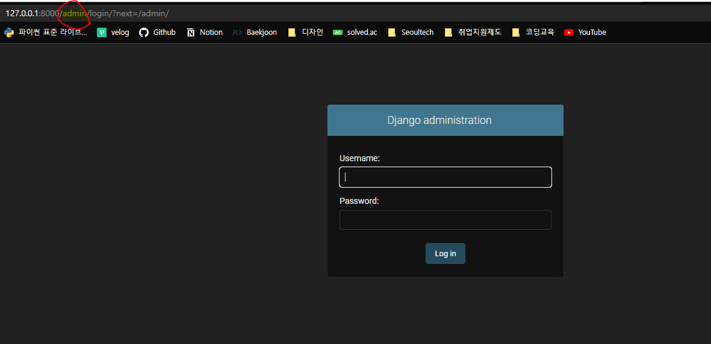

# [Django] 요청과 응답 [EP 02]

## 📚 Django 서버 실행

- 장고 서버 활성화하기(시작하기)
  - python manage.py runserver

- 요청 : http://127.0.0.1:8000/

- 응답 : 로켓 페이지

- Django 프로젝트를 생성한 후 바로 서버를 실행하면 로켓 페이지가 등장한다.


> 언어와 시간 설정
>
> settings.py에서 설정한다.
>
> LANGUAGE_CODE = 'ko-kr'
>
> TIME_ZONE = 'Asia/Seoul'

---

## 🚆 URLs

- urls.py

```python
from django.contrib import admin
from django.urls import path
from articles import views

urlpatterns = [
    path('admin/', admin.site.urls),		# 기본 제공 admin
    path('index/', views.???),				# 새로 만들 URL
]
```

- view를 import해서 가져와야한다.
- path 함수 사용
  - URL과 path함수가 일치하면 view 함수가 호출된다.
  - 접속할 땐 `/`를 끝에 안붙여도 되지만 입력할 땐 URL에 `/`를 무조건 붙여줘야 한다.
  - 함수를 호출할 땐 ()가 없다. path에서 콜백함수로 지정해서 사용한다.

- admin 페이지가 기본적으로 제공되어 있다.
  - 주소로 들어가서 admin을 뒤에 붙여주고 enter를 누르면 로그인 페이지가 등장한다.
  - http://127.0.0.1:8000/admin/ 으로 요청



ex). 클라이언트 : Chrome 브라우저, 서버 : Django

---

## 🔍 Views

- HTTP 요청을 수신하고 HTTP 응답을 반환하는 함수를 작성
- Model을 통해 요청에 맞는 필요 데이터에 접근
- Template에게 HTTP 응답 서식을 맡김


### view 함수의 규칙 

- 필수 인자 request : 요청 객체

- render를 이용
  - 첫번째로 무조건 request가 들어간다, 두번째로 template 경로가 들어간다.
  - 렌더링(render를 만들어서 보여준다고 생각하자.)

- views.py

```python
from django.shortcuts import render

# Create your views here.
def index(request):
    return render(request, 'index.html')


def greeting(request):
    context = {
        'name' : 'Alice',
    }
    return render(request, 'greeting.html', context)
```

---

## 📒 Templates

- 실제 내용을 보여주는데 사용되는 파일
- 파일의 구조나 레이아웃을 정의(HTML)


### 기본설정

- app 폴더 안에 templates를 만들어준다. 
- 장고의 기본값 : 장고는 app 아래의 templates 폴더를 탐색한다.
- 만든 폴더 안에 html(템플릿)들을 만들어준다.


### Django Template Language (DTL)

- Django template에서 사용

- 장고 Template은 템플릿은 HTML을 프로그래밍 구조로 사용할 수 있다. (if , for)


### DTL Syntax(문법)

1. `{{ variable }}`

   - 중괄호 사이에 공백을 하나씩 넣어준다. (장고 style)

   - render()를 사용하여 view.py에서 정의한 변수를 template 파일로 넘겨 사용하는 것

   - 변수명은 영어, 숫자와 밑줄(_) 조합으로 구성, 밑줄로 시작은 X(공백이나 구두점 문자 또한 X)

   - dot(.)를 사용하여 변수 속성에 접근

   - render의 세번째 인자로 딕셔너리 형태로 넘겨준다. => key에 해당하는 문자열이 template에서 사용 가능한 변수명이 됨

```django
<!DOCTYPE html>
<html lang="en">
<head>
  <meta charset="UTF-8">
  <meta http-equiv="X-UA-Compatible" content="IE=edge">
  <meta name="viewport" content="width=device-width, initial-scale=1.0">
  <title>Document</title>
</head>
<body>
  <p>안녕하세요 저는 {{ info.name }}입니다.</p
  <p>제가 가장 좋아하는 음식은 {{ foods }}입니다.</p>
  <p>저는 사실 {{ foods.0 }}를 가장 좋아합니다.</p>
</body>
</html>
```

> 출력!
>
> 안녕하세요 저는 Alice입니다.
>
> 제가 가장 좋아하는 음식은 ['apple', 'banana', 'coconut']입니다.
>
> 저는 사실 apple를 가장 좋아합니다.

2. `{{ variable|filter }}`
   - 표시할 변수를 필터링해서 바꾸거나 일부만 가져오기 위해 사용
   - ex). 소문자로 출력  => `{{ name|lower }}`
   - join 처럼 인자를 받기도 한다.

3. ``
   - 출력 텍스트를 만들거나, 반복 또는 논리를 수행하여 제어 흐름을 만드는 등, 변수보다 복잡한 일들을 수행
   - 일부 태그는 시작과 종료 태그가 필요

```django
  <p>메뉴판</p>
  <ul>
    
      <li>{{ food }}</li>
    
  </ul>
```

4. 주석 처리

```django
  {# 이것은 한 줄 주석입니다. #}

   
  <p>1</p>
  <p>1</p>
  <p>1</p> 
  
  
  {# ctrl /로 여러 줄 처리한다 #}
```

---

> 코드의 작성 순서
>
> URL -> VIEW -> TEMPLATE 순서
>
> 데이터의 흐름에 맞춰서 작성하는 것이다! (길을 잃지 말자!)