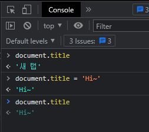
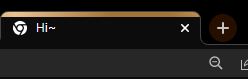

# [JavaScript] 자바스크립트란? [EP 01]

## 📌 자바스크립트의 정의

자바스크립트(JavaScript)는 브라우저 화면을 동적으로 만들어주는, 조작해주는 유일한 언어이다.

즉, 웹페이지에 생동감을 불어넣어주는 프로그래밍 언어이다.

> 자바랑 연관이 있나요?
>
> 연관이 없다! 
>
> 자바와는 다른 독자적인 언어이다. 그 당시 가장 유명했던 자바의 인기에 편승하기 위해 이름을 자바스크립트로 지은 것이다.

---

## 🎲 자바스크립트의 특징

HTML에서 구조를 잡으면 CSS가 표현을 해주고 JS에서 동작을 해준다.

HTML은 계산을 하지 않으니 프로그래밍 언어라고 부르지 않고 JS는 계산을 할 수 있으니 프로그래밍 언어라고 부른다.

HTML만으로는 조작해서 일부만 변경하려고 해도 전체적인 창을 새로 만들어서 보여줘야 했다. 자바스크립트는 부분적으로 조작할 수 있다~!

### 세미클론

자바스크립트는 세미콜론을 선택적으로 사용 가능하다.

> ASI : 세미콜론이 없으면 자동으로 세미콜론을 삽입해준다.

---

## 🎨 브라우저

브라우저 화면을 동적으로 만들어주기 위해 자바스크립트라는 언어를 사용한다고 했다.

그러면 브라우저란 무엇일까?

### 브라우저(browser) 란?

- URL로 웹(WWW)을 탐색하며 서버와 통신하고, HTML 문서나 파일을 출력하는 GUI 기반의 소프트웨어

주요 브라우저로 Google Chrome, Microsoft Edge, Safari, Naver Whale 등이 있다.

### 브라우저에서 하는 일

#### DOM(Document Object Model) 조작

문서(HTML)을 조작할 수 있다.

파싱(Parsing) : 브라우저가 문자열을 해석해 DOM Tree로 만든다.

> **HTML**은 트리 모델로 객체로 구조화 되어있다. 따라서 객체를 프로그래밍 언어적 특성을 활용해 조작할 수 있다.

브라우저에 자바스크립트 브라우저의 콘솔 창을 열어본다.

> Chrome 콘솔창 여는 방법
>
> 1. 마우스 우클릭 후 검사 - console 탭으로 들어간다.
> 2. Ctrl + Shift + J 단축키로 콘솔창을 실행한다.

콘솔창에 `document.title` 을 검색하면 브라우저 탭에 적힌 문구가 출력되고, `document.title`의 값에 다른 문자열을 할당하여 바꾸어 줄 수도 있다.

#### BOM(Browser Object Model) 조작

BOM은 브라우저의 창이나 프레임을 추상화하여 프로그래밍적으로 제어할 수 있도록 제공하는 수단이다.

버튼, URL 입력 창, 타이틀 바, 대화상자 창, 인쇄 창 등 웹 페이지 일부분을 제어할 수 있도록 한다.

#### JavaScript Core

브라우저(BOM, DOM)을 조작하기 위한 언어이다.

브라우저 BOM과 그 내부의 문서인 DOM을 조작하기 위해 ECMAScript(JS)를 학습한다.

> ECMA란?
>
> 정보 통신에 대한 표준을 제정하는 비영리 표준화 기구의 규격에 따라 정의한 언어이다.

---

## 📣 파편화

브라우저가 HTML 문서를 Web 페이지로 바꾸는 걸 지원해준다.

기존에는 브라우저마다 각자 만들다 보니, 웹페이지를 제작할 때 브라우저마다 다른 버전을 만들어야 했다. (파편화되어있는 상태)

파편화를 막기 위해 표준화!

웹 표준을 통해 브라우저를 만들고, html도 표준에 의해 만드니 호환이 잘 된다.

> 파편화 검색할 수 있는 사이트 : Can i use

