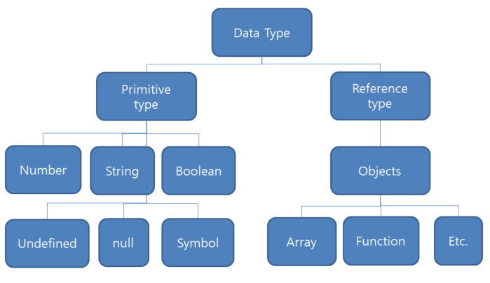

# [JavaScript] 데이터 타입 및 연산자[EP 03]

## 🎲 JS 데이터 타입

자바스크립트의 모든 값은 특정한 데이터 타입을 가진다.

크게 원시 타입(Primitive type)과 참조 타입(Reference type)으로 분류된다.



> Python에는 모든 데이터 타입이 객체였는데 자바스크립트에서는 Primitive type이 있는 것에 주의!

### 원시 타입

객체가 아닌 기본 타입

다른 변수에 복사할 때 실제 값이 복사된다.

- 숫자 타입

  정수, 실수 구분 없이 하나의 숫자 타입이다.

  NaN : 계산 불가능한 값은 다음 값으로 반환된다.

  Infinity, -Infinity : 양의 무한대, 음의 무한대

  ```javascript
  a = 3
  b = '제주도'
  c = 0
  console.log(a/b)		// NaN
  console.log(a/c)		// Infinity
  ```


- 문자열 타입

  작은따옴표 큰따옴표 모두 가능하다.

  **템플릿 리터럴**

  - python의 f - string 같은 역할을 한다.
  - 따옴표 대신 backtick(`)으로 감싸 표현한다.
  - 변수는 `${}`에 담아준다.

  ```javascript
  const viewCnt = 500
  console.log(`조회수 ${viewCnt}회`)	// 조회수 500회
  ```

  

- undefined

  변수의 값이 없음을 나타낸다.

  변수에 값을 할당하지 않으면 undefined가 할당된다.

  

- null

  변수의 값이 없음을 **의도적**으로 표현할 때 사용한다.

  typeof 연산자를 활용해 검색하면 object로 표현된다.(그렇지만 타입은 원시 타입이다!!)

> undefined와 null의 차이는 빈 값에 대해 개발자의 의도가 있는지 없는지로 나눌 수 있다.

```javascript
let unknown
console.log(unknown)	// undefined

const nullValue = null 
console.log(nullValue)	// null
console.log(typeof nullValue)	// object
```


- boolean 타입

  true / false로 표현한다.

  > 자동 형변환
  >
  > Undefined, Null, 0, -0, NaN, 빈 문자열 : 거짓	(-0, NaN도 있음 주의!!)
  >
  > 위에 나오지 않은 숫자타입, 비어있지 않은 문자열, Object : 참


### 참조 타입

함수, 배열, 객체

변수에 해당 객체의 참조 값이 담겨, 복사하면 참조 값이 복사된다.(주소 값)

---

## 📌 연산자

### 할당 연산자

`=`, `+=`, `-=`, `*=`, `/=` : 파이썬에 있는 연산자와 동일하다.

++, -- : 파이썬에 없는 연산자이다.

```javascript
let x = 0
x-- // x값을 1 감소
x++ // x값을 1 증가
```

> Airbnb Style Guide는 ++, -- 대신 +=, -= 권장!


### 비교 연산자

`>`, `<`: 파이썬과 동일하다.


### 동등 비교 연산자

`==` 암묵적 타입 변환을 통해 타입을 일치시킨 후 같은 값인지 비교한다.

예상치 못한 결과를 출력할 수 있으므로 특별한 경우를 제외하고 사용하지 않는다.


### 일치 비교 연산자

`===` : 엄격한 비교로 흔히 우리가 다른 언어에서 쓰던 동등 일치 비교 연산자이다.

> `==`보다 `===`을 사용하면 된다!


### 논리 연산자

자바나 C언어와 같다.

and 연산은 &&

or 연산은 `||`

not 연산은 `!`

> 파이썬과 같이 단축 평가를 지원한다.

```javascript
console.log(true || false)	// true
console.log(1 || 0)		// 1
console.log('' || 5)	// 5
console.log(4 || 7)		// 4
```


### 삼항 연산자

C나 자바와 같은 삼항 연산자를 지원한다.

`조건식 ? 참일 경우 출력할 값 : 거짓일 경우 출력할 값`

`condition ? expression if true : expression if false`

위와 같은 구조로 사용한다.

```javascript
console.log(true ? 1 : 2)	// 1
```

