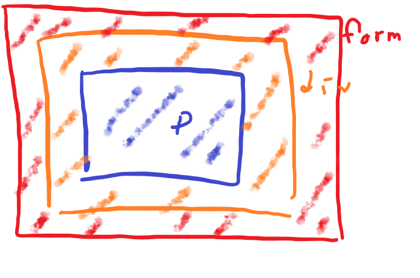

# [JavaScript] 이벤트(Event) [EP 11]


## 📌 이벤트 (Event)

- 네트워크 활동이나 사용자와의 상호작용 같은 사건의 발생을 알리기 위한 객체
- 신호보내기이다. 마우스 클릭이나 키보드 입력같은 사용자의 동작으로 발생한다.


## 🏓 EventListener

- 이벤트 객체들은 `EventTarget` 인터페이스를 구현하기 때문에 `addEventListener` 메서드를 호출하여 이벤트를 관찰 가능

- `EventTarget.addEventListener(type, listener[, options])`

  - type에는 반응할 이벤트 유형
  - listener는 실행할 콜백 함수

- 사용할 수 있는 이벤트 타입들 : [이벤트 참조 | MDN (mozilla.org)](https://developer.mozilla.org/ko/docs/Web/Events)

  > change와 input의 차이!!
  >
  > 공통점은 둘 다 사용자의 입력을 받는다.
  >
  > change: 요소 변경이 끝나면 발생(포커스를 잃을 때)
  >
  > input: 사용자가 값을 수정할 때마다 발생

- 이벤트의 발생을 받으면 콜백 함수를 실행!

  

### 콜백 함수

- 콜백 함수는 `addEventListener` 메서드에 함수명만 기입한다!!
- 콜백 함수는 event 객체를 인자로 받아서 사용한다. (event 명을 e로 쓰기도 한다.)
- EventListener 안에 함수를 만들어 줄 수도 있다.

```javascript
const onColorInput = function (event) {					// 이벤트를 받고 실행할 콜백 함수
    const userInput = event.target.value
    h2Tag.style.color = userInput
}

colorInput.addEventListener('input', onColorInput)		// eventlistner의 인자: 이벤트 타입과, 콜백함수

// 메서드 인자에 함수 생성
checkBox.addEventListener('click', function (event) {
    console.log(event)	// event 객체를 확인한다.
})
```


### 기본 동작 중단

HTML 요소의 기본 동작을 작동하지 않게 막는다.

- ex). a 태그의 링크 이동 / form 태그의 데이터 전송

콜백 함수 내에 `event.preventDefault()` 메서드를 실행한다.

> scroll처럼 막을 수 없는 이벤트들도 존재한다.
>
> `event.cancelable`로 확인한다.

```javascript
const checkBox = document.querySelector('#my-checkbox')

checkBox.addEventListener('click', function (event) {
    event.preventDefault()		// checkBox의 체크하는 이벤트를 막는다.
    console.log(event)
})
```


### 이벤트 객체 사용

- 이벤트 객체를 통해 이벤트를 발생한 타겟을 가져와 상태를 확인하고 사용할 수 있다. (CRUD)

- `event.target.classList` : 타겟 요소의 클래스를 CRUD

```javascript
event.target.classList.length	// 클래스 리스트의 길이로 있는지 확인할 수 있다.

event.target.classList.add('done') // 타겟 요소의 클래스를 추가한다.

event.target.classList.remove('done') // 타겟 요소의 특정 클래스를 지운다.

event.target.classList.contains('done') // 타겟 요소의 클래스에 특정 값이 있는지 확인

event.target.classList.toggle('done')	// 타겟 요소의 클래스가 있으면 생성, 없으면 제거한다.
```

- `event.target.style` : 타겟 요소의 스타일을 CRUD
- `event.target.tagName` : 태그 이름(열린 태그 닫힌 태그 사이에 적은 Text) 가져오기

```javascript
event.target.style.backgroundColor = 'yellow'	// 스타일 변경
alert("target =" + event.target.tagName + ", this=" + this.tagName)		// 태그명 가져오기
```

- `event.target.reset()` : Form 형식의 reset 효과

---

## 버블링(bubbling)

부모 요소에 event를 만들면 거품이 생기는 것처럼 이벤트가 전달된다.

자식 요소를 눌러도 event가 발생된다. 자식 요소에도 다른 핸들러가 있어도, 체인처럼 부모 요소 핸들러까지 다 동작한다!!

[버블링에 대한 설명!](https://joshua1988.github.io/web-development/javascript/event-propagation-delegation/)

focus는 버블링하지 않는다.(라벨 클릭하면 커서)

```html
<form onclick="alert('form')">Form
    <div onclick="alert('div')">Div
        <p onclick="alert('p')">P</p>
    </div>
</form>
```

위 코드를 그림으로 표현하면 다음과 같다.



빨간 부분을 클릭하면 form의 이벤트만 동작하고, p를 클릭하면 세 가지가 겹쳐있으니 셋 다 동작하게 된다.

이러한 상속에 주의하며 이벤트를 만든다.
