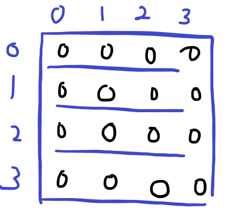
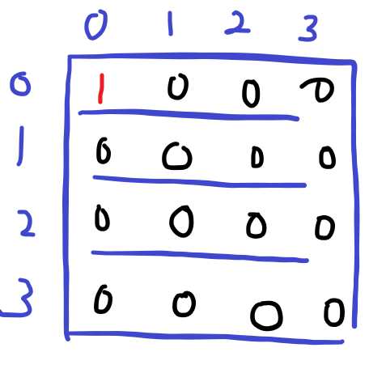
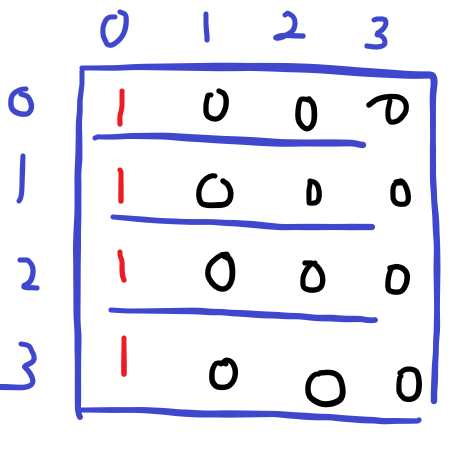

# [Python] 2차원 배열 초기화

2차원 배열을 초기화를 잘못하는 경우 값이 복사되는 경우가 존재한다.

값이 복제되지 않도록 초기화해줘야 한다.

아래 성공적인 초기화 방법과 잘못된 방법을 코드로 작성했다.

## 📒 코드

```python
n = int(input())
arr = [[0] * n for _ in range(n)]
arr = [[0 for _ in range(n)] for _ in range(n)]
'''
위 두 초기화 하는 방법은 옳은 방법, 같은 결과를 출력한다.
'''
arr [[0] * n] * n	# 잘못된 초기화 방법
```

위 방법은 성공적인 방법이다.

아래처럼 초기화하면 다른 차원들의 값까지 함께 복사된다.

먼저 선언한 후 결과를 보면 정상적인 2차원 배열의 모양이 나온다.

그림으로 보면 아래와 같다.



그렇지만 잘못 복사한 경우는 하나의 값을 바꾸면 나머지 차원도 함께 바뀐다.

(0, 0)의 값을 0에서 1로 변경하는 경우!

- 정상적으로 복사한 경우

  

- 비정상적으로 복사한 경우

  

  다른 차원까지 함께 복사된다.

---

위 같은 상황이 생기는 이유는..?

리스트의 곱셈 연산을 하는 경우를 생각해보면, 주소를 복사하는 것이다.

`[0] * n`을 하는 경우는 리스트를 복사할 때 [0]의 주소와 0의 주소가 같다. 따라서 0이라는 정수형의 주소를 저장한다.

`[[0] * n]] * n`은 `[0, 0, ..., 0]`의 주소를 복사한다. 따라서 리스트를 복사하여 여러 차원으로 나타내게 되는것이다.

리스트의 `*` 연산자를 활용할 땐 다음과 같이 리스트의 주소를 복사하게 되는지 정수형 타입의 값을 복사하게 되는지 염두하며 사용해야 한다.

